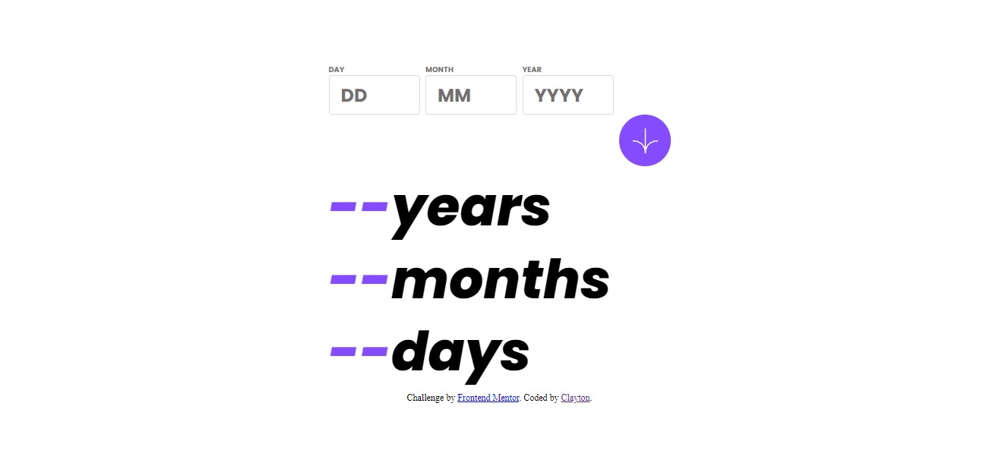
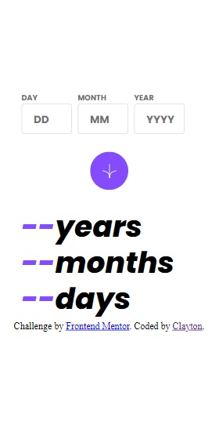

# Frontend Mentor - Age calculator app solution

This is a solution to the [Age calculator app challenge on Frontend Mentor](https://www.frontendmentor.io/challenges/age-calculator-app-dF9DFFpj-Q). Frontend Mentor challenges help you improve your coding skills by building realistic projects. 

## Table of contents

- [Screenshot](#screenshot)
- [Links](#links)
- [Built with](#built-with)
- [Author](#author)

### Screenshot

### Links

- Solution URL: [https://github.com/wait4ndbleed/age-calculator-app-main](https://github.com/wait4ndbleed/age-calculator-app-main)
- Live Site URL: [https://celadon-clafoutis-815a88.netlify.app](https://celadon-clafoutis-815a88.netlify.app)

### Built with

- Semantic HTML5 markup
- CSS custom properties
- Flexbox
- Javascript

## Author

- Website - [Clayton Ferreira](https://github.com/wait4ndbleed)
- Frontend Mentor - [@wait4ndbleed](https://www.frontendmentor.io/profile/wait4ndbleed) 
